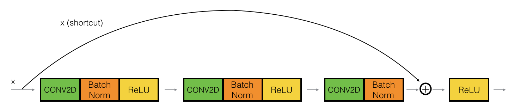

# Image Classification Project README

## Overview
This project focuses on image classification using a pre-trained ResNet50 model with TensorFlow/Keras. The task is to classify images into one of four categories: Benign, Malignant Pre-B, Malignant Pro-B, Malignant early Pre-B.

We utilized the ResNet50 architecture as the base model and added a few layers on top for fine-tuning. The final layer is a Dense layer with a softmax activation function to output probabilities for each class.


## Resnet Blocks structure:

The images for the architecture are obtained from this [blog](https://towardsdatascience.com/understanding-and-coding-a-resnet-in-keras-446d7ff84d33).

1. Identity Block:



2. Convolutional Block:


## Prerequisites
The dependent packages for MAP-NN are as follows:

* Python
* TensorFlow 
* opendatasets
* torch
* OpenCV
* Sklearn.cluster
* scipy
* skimage
* keras
* 
* 

## Usage
### prepare the training data
The data sould be divided into test set and training set, each with 4 categories, Benign, Malignant Pre-B, Malignant Pro-B, Malignant early Pre-B.

### training
We trained the model using a categorical cross-entropy loss function and the Adam optimizer with a custom learning rate schedule. The model was trained for 2 epochs on the provided data.


### Save processed data to Google drive 
To avoid the training interruption(which happens frequently in google colab train), all the processed data including checkpoints is saved in Google Drive

First call google drive 

```python from google.colab import drive
drive.mount('/content/drive')```
# Model Architecture

Then we save all the processed data to google drive, for example:

```python checkpoint_path = '/content/drive/MyDrive/checkpoints'
checkpoint_dir = os.path.dirname(checkpoint_path)

# Create a callback that saves the model's weights
cp_callback = tf.keras.callbacks.ModelCheckpoint(filepath=checkpoint_path,
                                                 save_weights_only=True,
                                                 verbose=1)
history =         model.fit(x=train_gen,
                            epochs=2,
                            validation_data=valid_gen,
                            steps_per_epoch=None,
                            workers=2,
                            callbacks=[cp_callback]
                            )```


Feel free to modify the content based on your specific project requirements and information.